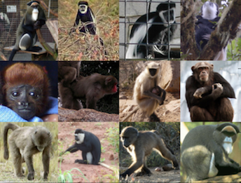
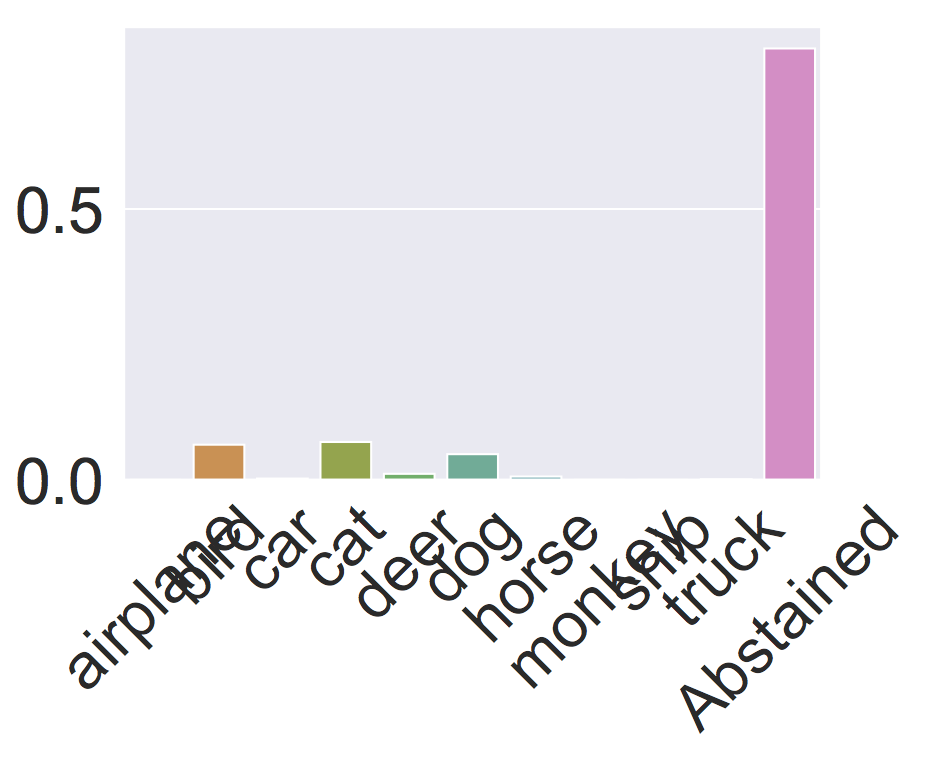
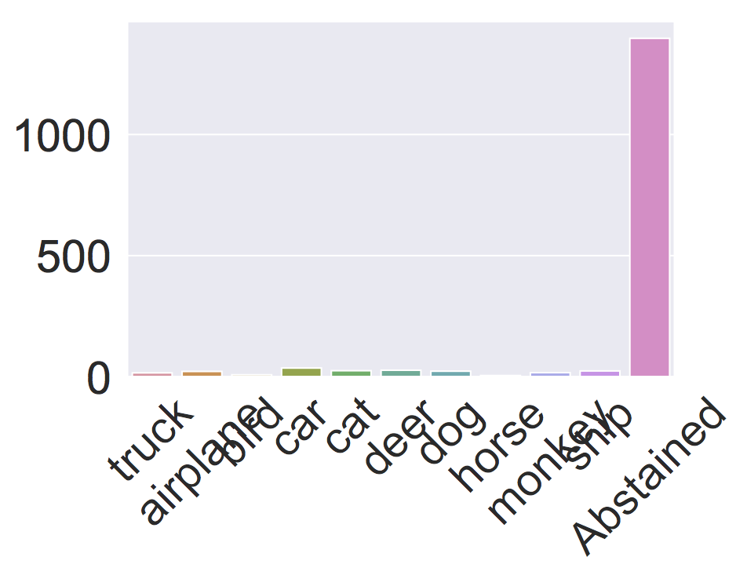
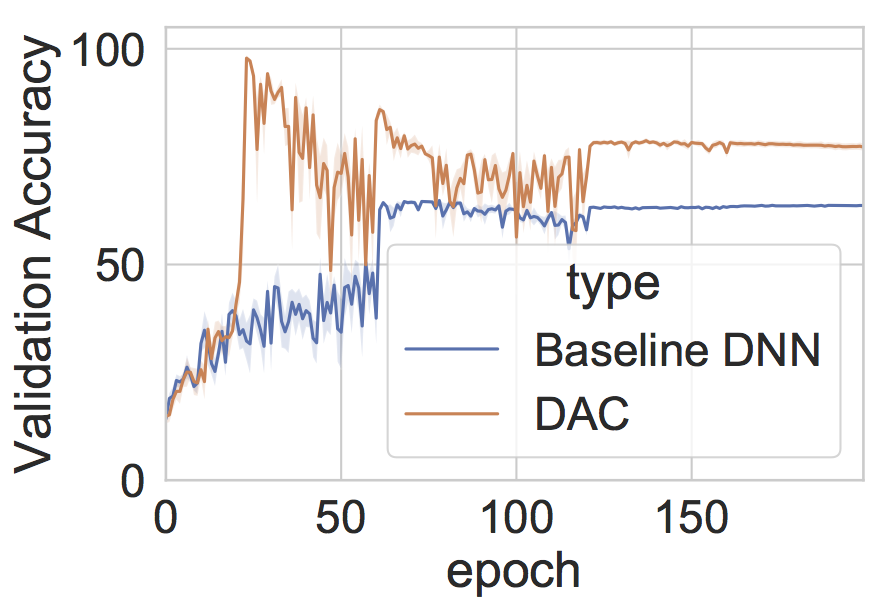
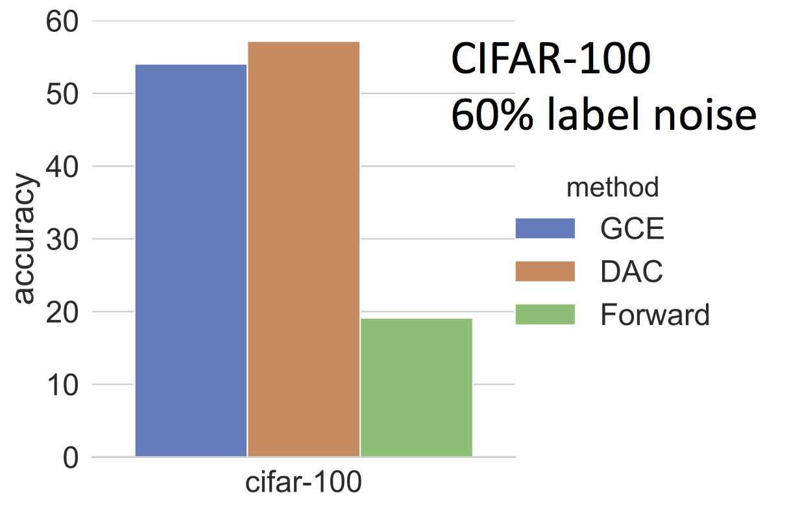
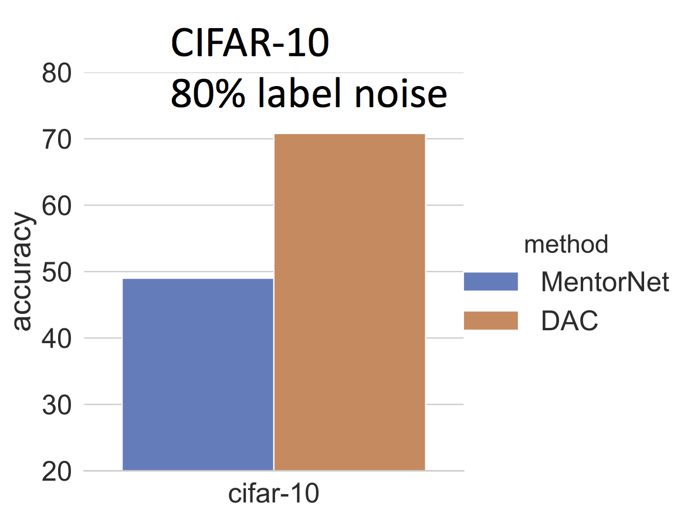
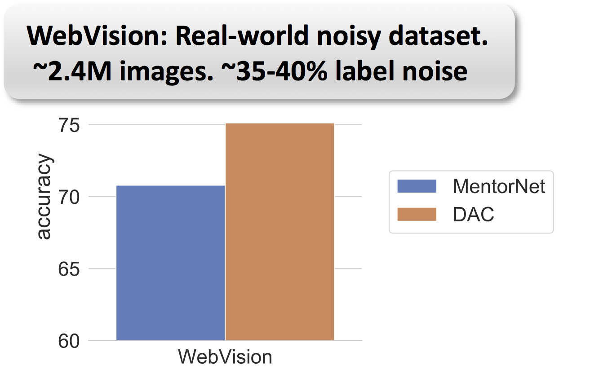
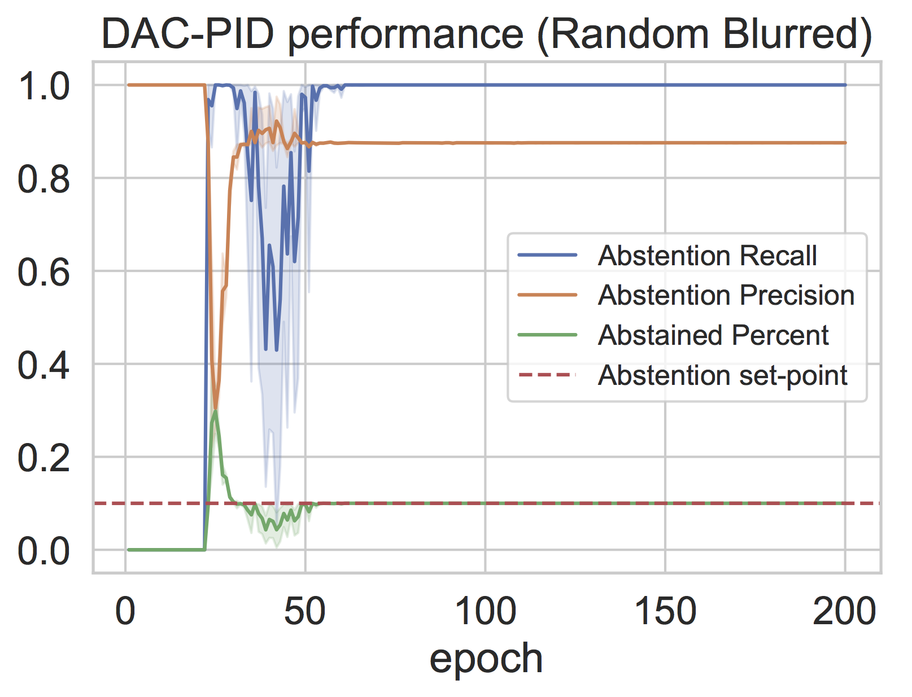

# Deep Abstaining Classifier: Label Denoising for  Deep Learning

PyTorch implementation of the deep abstaining classifier (DAC) from the  ICML 2019 paper:

**Combating Label Noise in Deep Learning Using Abstention**, Sunil Thulasidasan, Tanmoy Bhattacharya, Jeff Bilmes, Gopinath Chennupati, Jamaludin Mohd-Yusof 

The DAC uses an abstention loss function for identifying both [systematic](#identifying-systematic-label-noise) and [arbitrary](#identifying-arbitrary-label-noise) label noise  while training deep neural networks. 

**_New_: Abstention can now be stabilized at a desired setpoint**. This is useful if you have an estimate of the amount of label noise in your training data. See section on [stabilizing abstention at a pre-determined setpoint](#stabilizing-abstention-at-a-pre-determined-setpoint)

## Identifying Systematic Label Noise

The DAC can be used to learn features or corrupting transformations that are associated with unreliable labels. As an example, in the "random monkeys" experiment,  all the monkey images in the train-set have their labels randomized. During prediction, the DAC abstains on most of the monkey images in the test-set. 

<p float="left">


</p>

In another experiment, we blur a subset (20%)  of the images in the training set and randomize their labels. The DAC learns to abstain on predicting on the blurred images during test time.


<p float="left">
  
   
  
</p>


To re-run the random monkeys experiment described in the paper, 

- download the STL-10 dataset from https://cs.stanford.edu/~acoates/stl10/
- copy `data/train_y_downshifted_random_monkeys.bin` to the STL-10 data directory
- copy `data/test_y_downshifted_random_monkeys.bin` to the STL-10 data directory

and then run as follows:


`python train_dac.py --datadir  <path-to-stl10-data> --dataset stl10-c --train_y train_y_downshifted_random_monkeys.bin --test_y test_y_downshifted_random_monkeys.bin --nesterov --net_type vggnet -use-gpu --epochs 200 --loss_fn dac_loss --learn_epochs 20 --seed 0`

In the above experiment, the best abstention occurs around epoch 75.


## Identifying Arbitrary Label Noise

The DAC can also be used to identify arbitrary label noise where there might not be an underlying corrupting feature or transformation, but classes get mislabeled with a certain probability. 

### Training Protocol

- Use DAC to identify label noise
- Eliminiate train samples that are abstained
- Retrain on cleaner set using regular cross-entropy loss

The DAC gives state-of-the-art results in label-noise experiments. 


<p float="left">
  
   
  
  
</p>
[GCE: Generalized Cross-Entropy Loss (Zhang et al NIPS ‘18);  Forward (Patrini et al, CVPR ’17);  MentorNet (Li et al, ICML ‘18)]

More results are in our ICML 2019 paper. 

## Stabilizing Abstention at a Pre-Determined Setpoint

If you have an approximate estimate as to how much label noise is present in your training data, then abstention can be stabilized to this pre-determined setpoint. In the earlier version of the DAC, abstention rate would eventually decay to 0, but now can be stabilized indefinitely. This stabilization feature was recently added, and  uses a PID controller to achieve the desired setpoint.

As an example, in a 'random-blurring' experiment, we blur 10% of the images in the STL-10 dataset and randomize their labels. Abstention can then be stabilized at 10% as follows:

`python train_dac.py --datadir <path-to-stl10-data> --dataset stl10-c --train_x train_X_blurred_20_500.bin --train_y train_y_blurred_random_500.bin --nesterov --net_type vggnet -use-gpu --epochs 200 --loss_fn dac_loss --learn_epochs 20 --abst_rate 0.1`

<p align="middle">
  
</p>

Precision and recall are measured on the samples whose labels were incorrect and indicate the quality of abstention. In the above case, the DAC picks up the noisy labels both with high precision and recall.

To run the above experiment, you will need the following files. Download them and copy over to your STL-10 data directory.

- [train_X_blurred_20_500.bin](https://public.lanl.gov:/sunil/train_X_blurred_20_500.bin)
- [train_y_blurred_random_500.bin](https://public.lanl.gov:/sunil/train_X_blurred_20_500.bin)


### Tested with:

- Python 2.7 and 3.6
- PyTorch 1.0.1

### Citation
```
@InProceedings{pmlr-v97-thulasidasan19a,
  title = 	 {Combating Label Noise in Deep Learning using Abstention},
  author = 	 {Thulasidasan, Sunil and Bhattacharya, Tanmoy and Bilmes, Jeff and Chennupati, Gopinath and Mohd-Yusof, Jamal},
  booktitle = 	 {Proceedings of the 36th International Conference on Machine Learning},
  pages = 	 {6234--6243},
  year = 	 {2019},
  editor = 	 {Chaudhuri, Kamalika and Salakhutdinov, Ruslan},
  volume = 	 {97},
  series = 	 {Proceedings of Machine Learning Research},
  address = 	 {Long Beach, California, USA},
  month = 	 {09--15 Jun},
  publisher = 	 {PMLR},
  pdf = 	 {http://proceedings.mlr.press/v97/thulasidasan19a/thulasidasan19a.pdf},
```

This is open source software available under the BSD Clear license;

© (or copyright) 2019. Triad National Security, LLC. All rights reserved.
 
This program was produced under U.S. Government contract 89233218CNA000001 for Los Alamos National Laboratory (LANL), which is operated by Triad National Security, LLC for the U.S. Department of Energy/National Nuclear Security Administration. All rights in the program are reserved by Triad National Security, LLC, and the U.S. Department of Energy/National Nuclear Security Administration. The Government is granted for itself and others acting on its behalf a nonexclusive, paid-up, irrevocable worldwide license in this material to reproduce, prepare derivative works, distribute copies to the public, perform publicly and display publicly, and to permit others to do so.

